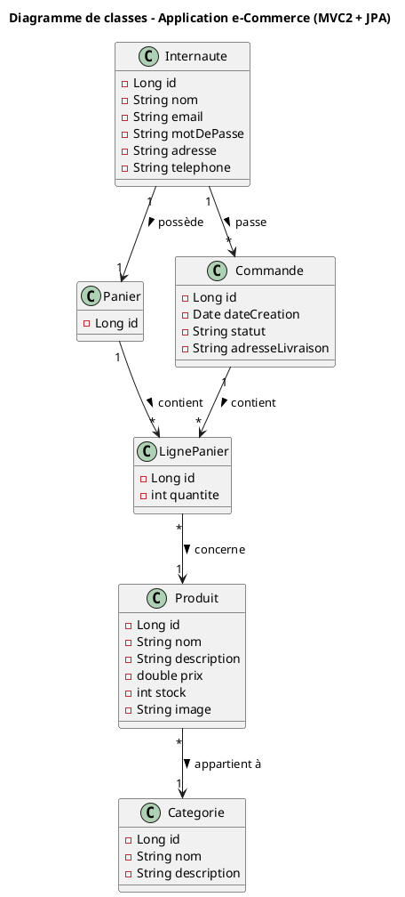

#  Mini Application E-Commerce — Jakarta EE 11, JPA & MVC2

Ce projet est une **application web e-commerce** développée dans le cadre de l’**Atelier 2**.  
Il illustre la mise en œuvre d’une architecture **MVC2** combinée à **JPA** pour la gestion d’un site vitrine, d’un **panier d’achat** et d’un **espace internaute**.


## Objectifs du projet

- Mettre en œuvre une application web respectant le **modèle MVC2**
- Utiliser **Jakarta EE 11** pour la gestion des entités et la logique métier
- Manipuler **JPA (Jakarta Persistence API)** pour la persistance des données
- Créer et gérer les classes du domaine : `Internaute`, `Produit`, `Panier`, `Commande`, etc.
- Générer automatiquement la base de données **MySQL** via JPA
- Déployer sur un serveur d’application **WildFly**
- Gérer les dépendances via **Maven**


## Architecture du projet

Le projet suit la structure standard d’un projet **Jakarta EE / Maven** avec cette structure:

```
Atelier2_Ecommerce/
├── .idea/
├── .mvn/
├── mvnw
├── mvnw.cmd
├── pom.xml
├── create.sql
├── .gitignore
├── src/
│   ├── main/
│   │   ├── java/
│   │   │   └── ma/fstt/atelier2_ecommerce/
│   │   │       ├── controller/
│   │   │       ├── model/
│   │   │       │   ├── dao/
│   │   │       │   ├── entity/
│   │   │       │   └── service/
│   │   │       ├── util/
│   │   │       └── TestJPA.java
│   │   ├── resources/
│   │   │   └── META-INF/
│   │   │       └── persistence.xml
│   │   └── webapp/
│   │       ├── images/
│   │       └── WEB-INF/
│   │           ├── beans.xml
│   │           ├── web.xml
│   │           └── views/
│   │               ├── accueil.jsp
│   │               ├── inscription.jsp
│   │               ├── login.jsp
│   │               ├── panier.jsp
│   │               └── produits.jsp
│   └── index.jsp
├── test/
└── target/
```


##  Technologies utilisées

| Technologie / Outil | Rôle |
|----------------------|------|
| **Jakarta EE 11** | Standard Java Entreprise |
| **Maven** | Gestionnaire de dépendances |
| **WildFly** | Serveur d’application |
| **MySQL** | Système de gestion de base de données |
| **EclipseLink (JPA)** | Mapping objet-relationnel |
| **CDI (Context Dependency Injection)** | Injection de dépendances |
| **Lombok** | Réduction du code (getters/setters/constructeurs) |
| **JSTL + JSP** | Vue dynamique |
| **IntelliJ IDEA / Eclipse** | Environnement de développement |


## Étapes principales de réalisation

1. **Conception UML**  
   Création du diagramme de classes : `Internaute`, `Produit`, `Panier`, `Commande`, `LignePanier`, `Categorie`.

2. **Création du projet dynamique** 

   Ajout des dépendances nécessaires dans `pom.xml`.

3. **Mise en place de JPA**  

   Configuration du fichier `persistence.xml`  
   Génération automatique de la base `ecommerce_db`.

4. **Création des DAO et Servlets**  
   
   Communication entre la couche modèle et la couche vue via CDI.

5. **Création des JSP (Vue)**  
   
   Utilisation de JSTL pour afficher les données dynamiques.


## Diagramme de classes (PlantUML)


 ## Installation et exécution

Cloner le dépôt :

git clone https://github.com/Lorraine301/Atelier2_Ecommerce_JPA.git

cd Atelier2_Ecommerce_JPA


 ## Importer le projet dans ton IDE (Eclipse / IntelliJ)

Sélectionner : Import → Existing Maven Project

 ## Configurer la base de données MySQL

CREATE DATABASE ecommerce_db;


 ## Mettre à jour persistence.xml avec tes identifiants MySQL
 Modifie les champs suivants selon ta configuration MySQL : 
```
<property name="jakarta.persistence.jdbc.url" value="jdbc:mysql://localhost:3306/ecommerce_db"/>
<property name="jakarta.persistence.jdbc.user" value="root"/>
<property name="jakarta.persistence.jdbc.password" value="ton_mot_de_passe"/>

```
Déployer sur WildFly

Copier le .war généré dans le dossier standalone/deployments

Ouvrir l’application :
http://localhost:8080/Atelier2_Ecommerce-1.0-SNAPSHOT/

 ## Auteur

RAHELIARISOA Andriamasy Lorraine Agnès
Étudiante en LSI – 2ᵉ année cycle ingénieur
Projet réalisé dans le cadre de l’Atelier 2 — Application Web Jakarta EE.
